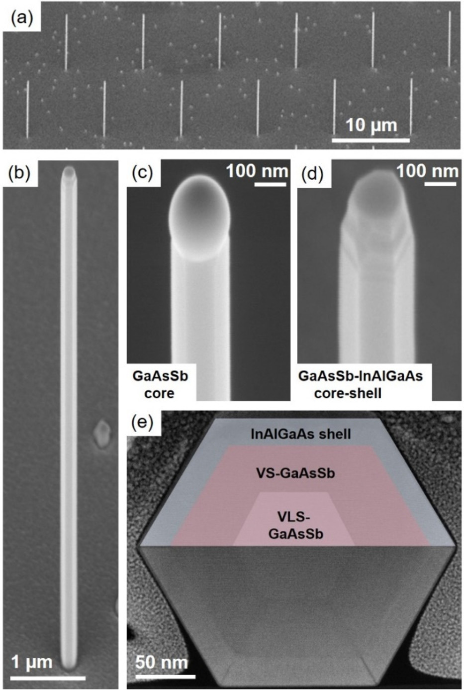
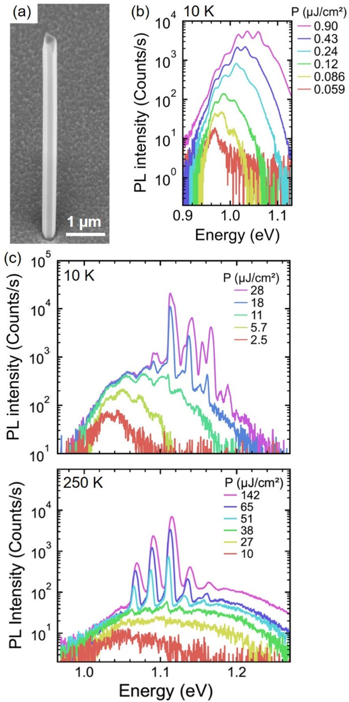

# First true ternary near-IR III-V NW-lasers

## Silicon transparent wavelengths achieved at near to room temperature.

Researchers based in Germany have demonstrated lasing from single, ternary
gallium arsenide antimonide (GaAsSb) nanowire-(NW-)lasers, accessing wavelengths at which silicon (Si) is transparent and at temperatures close to room temperature [[P. Schmiedeke et al, Appl. Phys. Lett., v124, p071112, 2024]](https://doi.org/10.1063/5.0191070).

The team from Technical University of Munich, and Ludwig-Maximilians-University Munich, comments: "These advanced, and, in fact, first true ternary near-infrared III–V NW-lasers were enabled by two key factors, i.e., GaAsSb NWs with suitable cavity lengths and the exploitation of lattice-matched indium aluminium gallium arsenide (InAlGaAs) surface passivation with &gt;200-fold emission efficiency enhancement. The high-quality NW-lasers were reflected by very low lasing thresholds (&sim;3&micro;J/cm2 at 10K and &sim;45&micro;J/cm2 at 250K) that are competitive with the best ever reported III–V NW-lasers in the literature."

Binary III-V NW lasers require complex heterostructures to massage the wavelength into the silicon-transparent region longer than 1.1&micro;m. Such wavelength are needed for silicon photonics, and other high-speed optical communication systems. Ternary material lasers would use the bulk material as the lasing medium. Up to now, ternary NW lasers have been size limited and needed external cavity structures to operate in the Si-transparent region. The Munich NWs use their own intrinsic resonator cavities as the lasing medium.

 |
--- |
Scanning electron microscope (SEM) images of InAlGaAs-passivated GaAsSb NWs (&sim;20% Sb-content): (a) overview image of array at 10&micro;m pitch; (b) higher magnification of a single NW; (c) core-only GaAsSb reference showing Ga droplet at tip; and (d) corresponding image of core–shell GaAsSb-InAlGaAs NW. (e) Cross-sectional scanning transmission electron microscopy high-angle annular dark field (STEM-HAADF) image and overlaid, color-coded schematic of the GaAsSb-InAlGaAs core&ndash;shell structure. |

The NWs (Figure a) were produced on pre-patterned silicon dioxide/silicon (SiO2/Si(111)) substrate via selective-area molecular beam epitaxy (MBE). The researchers used a recently developed self-catalyzed vapor-liquid-solid (VLS) growth scheme.

The GaAsSb NW lasers were grown on a 0.3&micro;m GaAs NW nucleation stem. The laser cavity length of the NWs was around 5.2&micro;m. The GaAsSb growth temperature was 660&deg;C, aiming at an Sb content of 25%. The core diameter was about 260-270nm, while &sim;30nm quaternary In0.5Al0.17Ga0.33As was added as shell passivation.  The shell growth temperature was 420&deg;C.

A study using energy-dispersive x-ray spectroscopy (EDXS) on NWs with slightly different compositions (&sim;20% Sb-content) suggested that the GaAsSb core consisted of two regions: an inner part with a higher Sb content of 20% and an outer region with a lower content of 15%. These compositions were found to be uniform along the growth axis. 

The team comments: "The center (Sb-rich) region is attributed to the VLS-GaAsSb growth along the NW-axis, whereas the surrounding region stems from a spontaneous vapor&ndash;solid (VS) sidewall growth that stabilizes the non-tapered NW-morphology via step-flow growth."

For the lasers, the inner and outer Sb-contents increased to 25% and 20%, respectively, with a view to shifting the spectral response to wavelengths longer than 1.2&micro;m.

 |
--- |
(a) SEM image of InAlGaAs-passivated GaAsSb NW-laser; (b) photoluminescence (PL) spectra under low pump fluences; and semi-logarithmic plots of PL spectra under higher pump fluences at 10 (c) and 250K (d). |

A single NW lying on sapphire was subjected to optical pumping at 10 and 250K (Figure b). Lasing occurred at higher pump power with distinct peaks at energies between &sim;1.06 and 1.15eV. Below threshold, the spectrum peaked around 1.28&micro;m wavelength. At 10K, the transition from amplified spontaneous emission to lasing began around 11&micro;J/cm2. The 250K peaks were shifted about 50meV in energy, reflecting thermal bandgap narrowing. The lasing thresholds for 10 and 250K were 12.1 and 45.2&micro;J/cm2, respectively. One NW had a 10K laser threshold as low as 3.2&micro;J/cm2.

The researchers attribute the laser emissions to the HE11 modes of the laser cavity. Lower laser thresholds could be accessed from TE01 modes, but this would require NWs of diameter larger than 400nm for this wavelength range.

_The author Mike Cooke is a freelance technology journalist who has worked in the semiconductor and advanced technology sectors since 1997._