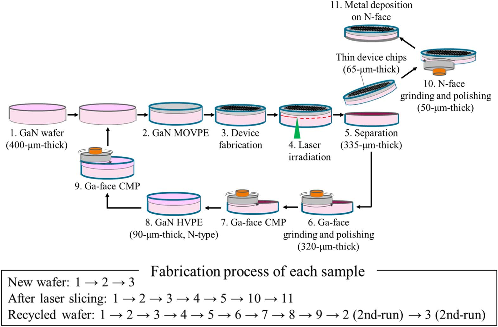
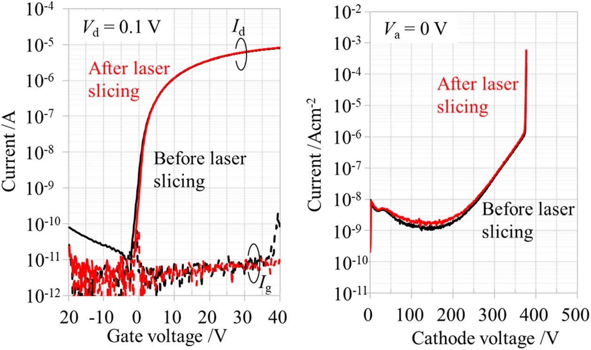
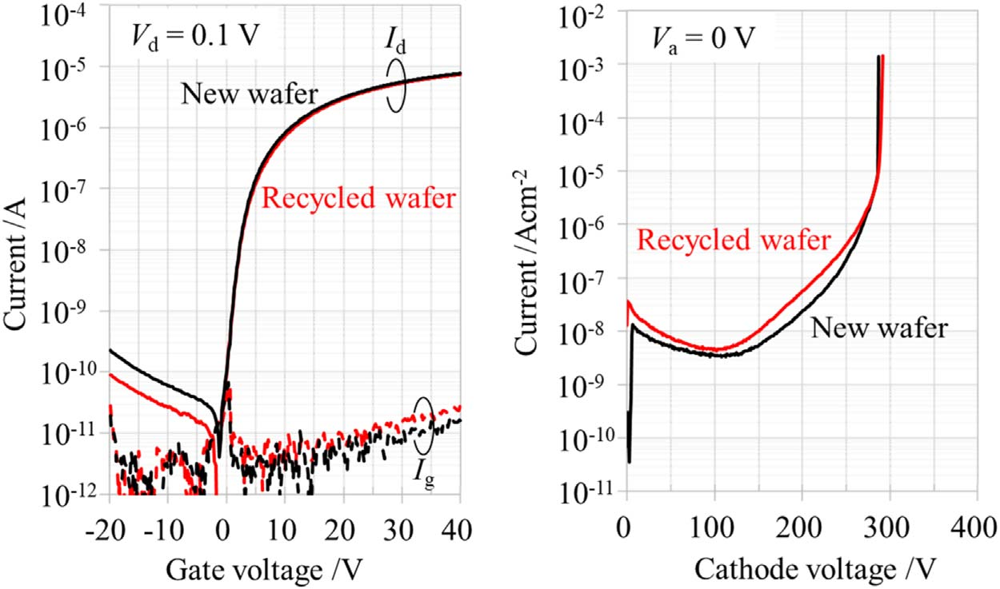

# Recycling GaN for vertical power device performance

## Researchers see potential cost savings for key electric vehicle markets.

[MIRISE Technologies Corporation](https://www.mirise-techs.com/en/), Nagoya University, and [Hamamatsu Photonics K.K.](https://www.hamamatsu.com/jp/en.html), Japan, report on the potential for recycling gallium nitride (GaN) substrates with a view to reducing costs for high performance power devices [[Takashi Ishida et al, Appl. Phys. Express, v17, p026501, 2024]](https://doi.org/10.35848/1882-0786/ad269d). The team comments: "The proposed recycling process is an effective method for reducing the cost of GaN substrates and has the potential to encourage the popularization of GaN vertical power devices."

Vertical devices presented up to now tend to be produced on expensive freestanding or bulk GaN substrates. Lateral devices can be produced on lower cost substrates, like silicon, particularly for the lower voltage ratings.

Previous work has investigated the electrical performance lateral GaN high electron mobility transistors (HEMTs) on GaN substrate before and after the laser slicing process used to reclaim the expensive GaN substrate. A thick epitaxial layer was added to the reclaimed wafer after slicing, but electrical properties of devices fabricated on such recycled wafers has not been reported previously.

The potential of GaN as a premium material for power electronics is based on a high critical field (&sim;10x that of silicon) and high channel mobilities (&sim;2x those achieved in devices on silicon carbide, SiC). Another advantage of GaN over SiC is a lower epitaxial growth temperature, which reduces production cost.

MIRISE was founded in 2020 to carry out "research and development of in-vehicle semiconductors and development of electrical components that use semiconductors". The company is joint owned by DENSO Corporation (51%) and Toyota Motor Corporation (49%). Hamamatsu Photonics produces optical sensors, light sources, and systems that use these components.

The researchers see high potential for vertical power devices in "high power applications such as in-vehicle inverters that control main motors".

 |
--- |
Overview of GaN substrate recycling through laser slicing. |

The recycling consisted of separating a relative thin layer with fabricated devices from the bulk of the GaN substrate (Figure a).

The separation was accomplished using a 532nm focused laser beam from the N-side (bottom) of the wafer. The GaN decomposed into Ga metal and N gas at the focal plane in a two-photon absorption process. The focal plane could be adjusted to give different thicknesses for the separated wafer.

After the separation the rough separation surfaces were smoothed by grinding and polishing before further processing. 

For the device wafer, processing was completed with deposition of the N-side metal and assembly into packages. The recycled wafer was subjected to chemical mechanical polishing (CMP) and hydride vapor phase epitaxy (HVPE) to return it to a state ready for further metal-organic vapor phase epitaxy (MOVPE) and fabrication.

The researchers comment: "It is indispensable to avoid wafer cracks for the success of the recycling process. To avoid wafer cracks, the suppression of the wafer warp caused by thinning wafer thickness is necessary. In particular, the amount of Ga-face grinding and polishing after separation should be minimized."

The researchers fabricated lateral metal-oxide-semiconductor field effect transistors (MOSFETs) and vertical PN diodes.

The MOVPE device layers consisted of 4&micro;m n&minus;-GaN drift layer and 2&micro;m p-GaN on n+-GaN substrate. The n&minus;- and p-doping concentrations were 1x and 5x1017/cm3, respectively.

The n-type MOSFET source and drain regions were fabricated using Si ion implantation through windows in the 100nm silicon dioxide (SiO2) capping layer. The n-implant and p-body dopants were activated by 1050&deg;C annealing in nitrogen for 5 minutes.

PN diodes were fabricated by removing the SiO2 layer and creating beveled mesa structures for edge termination. The bevel angle and depth were 6&deg; and 30&micro;m respectively.

The MOSFET gate insulation was provided by 100nm SiO2 from plasma chemical vapor deposition (CVD). The MOSFET gate, source, drain, and body electrodes were 160nm sputtered nickel (Ni).

This nickel deposition also provided the anode terminal on the p-side of the vertical PN diodes fabricated on the same wafer as the MOSFETs. The n-side cathode consisted of 500nm sputtered aluminium (Al) on the backside of the wafer.

 |
--- |
(a) Drain (Id) and gate (Ig) current versus gate potential (Vg) for lateral MOSFET and (b) reverse curves of vertical PN diode before and after laser slicing. |

Key characteristics for the MOSFETs for devices fabricated on fresh wafers showed somewhat better average performance after separation (Figure e).  However, the vertical PN diode structure did suffer some slight degradation in leakage under reverse bias after separation.

 |
--- |
(a) Drain and gate leakage versus MOSFET gate potential for devices fabricated on new and recycled wafers. (b) Reverse leakage versus cathode  voltage (Vc) of vertical PN diode. |

The recycling process was verified by processing a recycled- along with a fresh-wafer from the same supplier, simultaneously, both in terms of MOVPE and device fabrication (Figure d). The recycled lateral MOSFET seems to have lower drain leakage in the OFF state (negative gate potential), but higher gate leakage at 40V. The recycled PN diode has a somewhat larger leakage under reverse bias.

The threshold voltages of the lateral MOSFETs were between &minus;0.1 and +0.8V. The MOSFET channel mobilities were in the range 70&ndash;80cm2/V-s. This is lower than report vertical transistor mobilities in the range 173&ndash;266cm2/V-s.

_The author Mike Cooke is a freelance technology journalist who has worked in the semiconductor and advanced technology sectors since 1997._