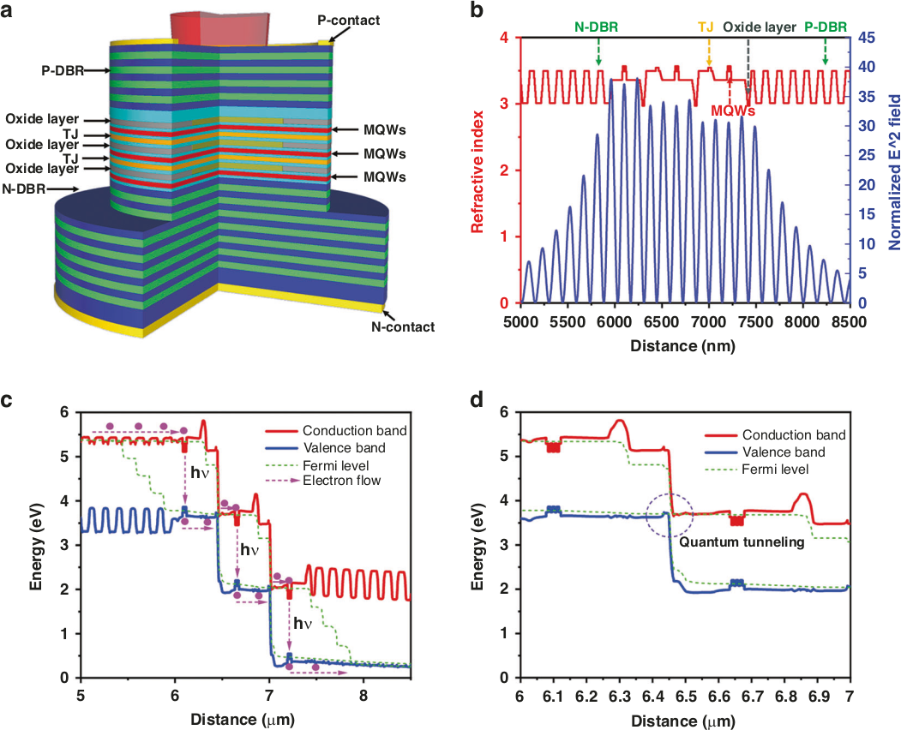
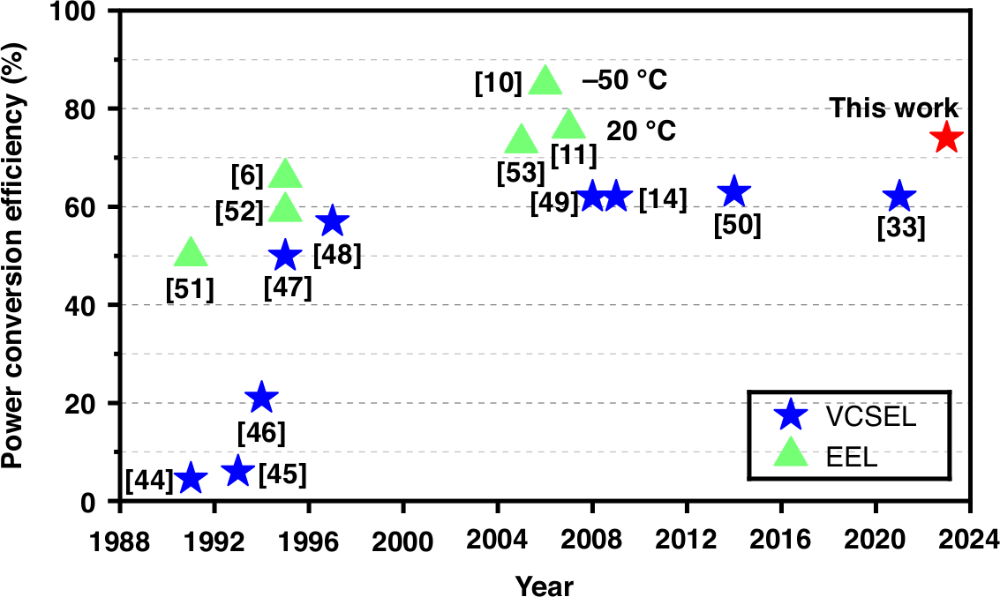

# Cascading VCSELs to boost power efficiency

## Room temperature performance comparable with edge-emitting devices.

Sichuan University, and [Suzhou Everbright Photonics](https://en.everbrightphotonics.com/) Co., Ltd, China, report on cascaded vertical-cavity surface emitting lasers (VCSELs) with up to 74% power conversion efficiency (PCE) at room temperature [[Xiao et al, Light: Science & Applications, v13, p60, 2024]](https://doi.org/10.1038/s41377-024-01403-7).

By stacking VCSELs, the design increases optical gain multiplicatively, overcoming resistance and other internal losses that impact efficiency. 

Single VCSELs have lower power efficiency compared with edge-emitting lasers (EELs) in general. For one device, the researchers report a differential quantum efficiency exceeding 1100%, which along with the 74% PCE, represent "the largest electro-optical conversion efficiency and differential quantum efficiency reported until now for VCSELs". The researchers also believe that the differential efficiency is a present world record for all types of semiconductor laser.

The researchers comment: "This performance improvement offers a potent solution to the energy consumption issues of VCSELs in their widespread future applications. Considering this, we plan to further explore the potential applications of multi-junction VCSELs in the field of communication in the future."

For communications the series connection of multiple VCSELS reduces the capacitance of the resonant cavity. The researcher comment: "The increased gain volume allows us to maintain a low threshold while reducing the top reflectivity, thereby decreasing the photon lifetime and enhancing the modulation bandwidth"

High power is also particularly useful for time-of-flight "laser radar" (LiDAR) for longer range mapping.

Suzhou Everbright Photonics Co., Ltd, established in 2012, is a company specializing in high-power diode laser chips, and high-efficiency LiDAR, 3D sensing, high-speed optical communication and related optoelectronic systems.

 |
--- |
a Structural schematic diagram; b refractive index distribution, standing wave light field distribution; c active region band structure of 3-junction VCSEL under bias. d Tunnel junction band structure under bias. |

The design for the cascaded VCSEL (Figure a) included an N-type distributed Bragg reflector (N-DBR), P-DBR, multiple quantum wells (MQWs), oxidation layers, and tunnel junctions (TJs) connecting the stages. The aim was to place the wells at anti-nodes, and the oxide apertures and TJs at nodes, of the optical field. Having the wells at points of maximum oscillation, one would enhance the coupling efficiency between carriers and photons, increasing optical gain. Loss from free carrier absorption in the TJ was reduced by positioning at a node.

The material was grown using metal-organic chemical vapor deposition (MOCVD). The DBRs used aluminium gallium arsenide (AlGaAs) alloy layers of different compositions. The quantum wells were 7nm indium gallium arsenide (InGaAs) with 6nm gallium arsenide phosphide (GaAsP) barriers. The MQW structures consisted of three wells. The oxidation layers were 20nm AlGaAs. The TJs were 15nm GaAs, suitably doped.

The oxidation apertures were formed during fabrication after mesa etching by exposure to high temperature and humidity conditions, oxidizing the high Al-content AlGaAs material, leaving a 10&micro;m-diameter aperture in the non-oxidized core. Passivation was provided by plasma-enhanced CVD silicon nitride (Si3N4). The substrate was reduced to 80&micro;m for testing.

 |
--- |
VCSEL cascade performance with different numbers of junctions: a, b Light output power, current, and voltage (L-I-V); c PCE of different numbers of junctions; d slope efficiency and threshold current. |

Fabricated devices were operated under 20ns pulses at 0.1% duty cycle (50kHz). A 15-junction VCSEL achieved 100mW peak power at 7mA injection (Figure b). The maximum electro-optical conversion, slope, and differential quantum efficiencies were 74%, 15.6 W/A, and more than 1100%, respectively.

The turn-on voltage of 19V for the 15-junction device is seen as being advantageous for short pulse, high modulation rate applications. "Electrical signals with high voltage are more conducive to generating extremely short pulse widths and higher modulation rate signals compared to high current signals," the researchers explain.

The threshold current showed a declining trend with number of junctions, despite a reduced top DBR reflectivity in the VCSELs with larger numbers of junctions. The researchers believe that optimizing the top DBR reflectivity could reduce the threshold further.

Simulations suggest that a 20-junction device could reach 88% PCE. Apart from the top DBR reflectivity, the researchers believe that inconsistent quality between the top and bottom MQWs impacted the performance of the actual 15-junction VCSEL cascade.

Study of the far-field emission showed the divergence angle increased with number of junctions. A 6-junction VCSEL cascade had a divergence of 28.8&deg;.

The team comments: "A large divergence angle is disadvantageous for many application scenarios, hence, existing multi-junction VCSELs used in LiDAR typically reduce the number of oxide layers to decrease the divergence angle. In 2022, we reported that through the design of the oxide layers, the divergence angle in an 8-junction VCSEL was reduced to 18&deg; for short pulse driving current."

The emission wavelengths of the devices was in the 940&ndash;950nm range. As the number of junctions increased, the number of excited modes increased.

Based on a power consumption analysis, the team believes the improvement in PCE with the number of junctions is mainly attributable to reductions in Joule heating and in internal losses from free carrier absorption.

 |
--- |
Summary of reported semiconductor laser PCEs for VCSELs and edge-emitting lasers. |

The researchers compare their 15-junction device with other reported semiconductor lasers (Figure c), commenting that it "marks not only a significant improvement in VCSEL efficiency over the past two decades but also essentially reaches a level comparable to the highest power conversion efficiency of EELs under room temperature conditions." While EELs have achieved 86% at low temperature, the room temperature PCE of 76% is comparable with the 74% performance of the 15-junction VCSEL.

_The author Mike Cooke is a freelance technology journalist who has worked in the semiconductor and advanced technology sectors since 1997._