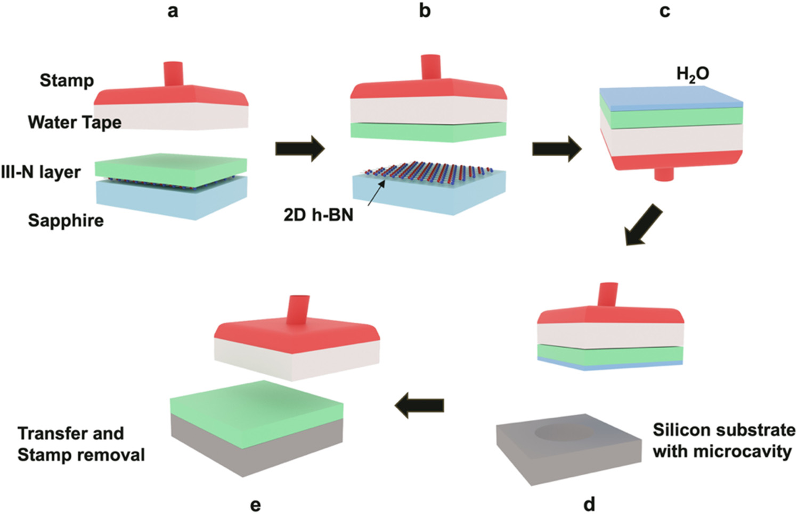
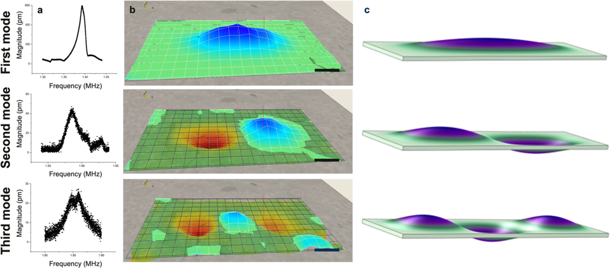

# Layer-transfer of III-N MEMS through 2D hBN

## Researchers fabricate free-standing structures on silicon microcavities.

Researchers based in France and the USA report on the extension of two-dimensional (2D) material-based layer transfer to simple fabrication of free-standing III-nitride micro-electro-mechanical systems (MEMS) on silicon [[Rajat Gujrati et al, Appl. Phys. Lett., v124, p104102, 2024]](https://doi.org/10.1063/5.0191772)

The team from the [GT-CNRS International Research Lab](http://research.georgiatech-europe.eu/) collaboration between [Georgia Institute of Technology](https://www.gatech.edu/), USA, and France's [CNRS](https://www.cnrs.fr/en/the-cnrs) government research organization, along with the [Universit&eacute; de Bordeaux](https://www.ims-bordeaux.fr/) and the [LAAS-CNRS](https://www.laas.fr/en/) systems research laboratory, France, comments: "The realization of flexible III-N MEMS, which are difficult to manufacture through conventional micromachining processes, would open the door to a wide range of applications, from wearable devices for health monitoring to the internet of things, even if further technical developments are needed to reach the level of yield and device performance offered by conventional fabrication methods."

The researchers suggest the methods could be extended to flexible substrates, such as polyethylene terephthalate (PET) or Kapton.

Apart from the wide bandgaps exhibited by III-nitride materials such as aluminium gallium nitride (AlGaN), they also feature important piezoelectric and piezoresistive characteristics, high temperature stability, chemical robustness, and potential for GaN electronics integration. AlGaN/GaN structures also generate a thin "two-dimensional electron gas" (2DEG) near the interface of the two materials. The 2DEG is a key component of high electron mobility transistors (HEMTs), operating as channel between source and drain. The 2DEG formation is also attractive in a MEMS sensor context, where it can function as a strain transducer.

Reports of GaN MEMS structures include Lamb wave resonators, infrared
detection, and electronic filters. Layer transfer techniques enable high quality growth on reusable substrates, lowering production costs.

 |
--- |
(a, b) Water-soluble adhesive tape used to pick up epilayer grown on h-BN/sapphire template. (c, d) Epilayer transferred using pressure and capillary forces onto silicon substrate with etched cavities and (e) tape dissolved to obtain III-N structure held to silicon substrate by van der Waals forces. |

The researchers used a pick-and-place method to fabricate free-standing III-N MEMS structures on silicon (Figure a). The III-nitride material was grown on a hexagonal boron nitride (hBN) layer on sapphire and transferred the material to a microcavity in a silicon substrate. The growth method was metal-organic chemical vapor deposition (MOCVD). Two samples were produced: one with 300nm GaN and 300nm AlGaN layers on 3nm hBN, and the other with 2.5&micro;m hBN.

The hBN consists of 2D layers of atoms held together by covalent forces. The weaker van der Waals forces between the layers enables relatively easy separation of the material grown on the hBN.

A 15mmx15mm stamp with double-sided water-soluble adhesive tape on its surface picked the III-N from the growth substrate. The underside of the III-N structure was wetted with a water-soaked lens wipe before placing in 22&micro;m-deep microcavities deep reactive-ion etched (DRIE) into a silicon substrate. The wetting enabled "capillary assembly" where "the drying of a water film at the interface of the III-N film and the substrate is used to create a large surface area to promote adhesion via van der Waals forces," the team explains.

The stamp was removed by dissolving the tape by immersion in a water-filled beaker for 30 minutes.

 |
--- |
(a) Resonance spectra of first three modes of rectangular AlGaN/GaN plate on silicon at largest displacement location; (b) corresponding measured 3D displacement maps showing maximum deflection amplitude (scale bars: 20&micro;m); and (c) COMSOL simulations. |

The researchers studied the material structures' mechanical properties by placing the assemblies on lead zirconate titanate (PZT) piezoelectric actuators (Figure b). Excitations were detected using laser Doppler vibrometry. The lowest mode frequencies for a GaN/AlGaN structure in a 180&micro;mx60&micro;m cavity were 1.39, 1.58, and 1.85MHz, respectively. Finite element method simulations with typical Young's modulus values for the component materials (261GPa EGaN, 285 GPa EAlGaN) gave corresponding values of 1.25, 1.39, and 1.65MHz. The 2nd/3rd mode ratios relative to the 1st mode were 1.14/1.33 experimentally, and 1.11/1.32 in simulation.

The mechanical behavior of hBN in a 450&micro;mx150&micro;m format was more difficult to interpret. Single layer hBN has a Young's modulus around 0.8TPa. Thicker layers, beyond 8 mono-layers, show a much reduced value. The modulus value extracted from the behavior of the hBN plate was 18GPa. The researchers also varied some other parameters in an attempt to fit the experimental data with a higher Young's modulus of 120GPa, "the lowest value found in the literature". In particular, the researchers studied the possibilities of residual stress in the plate, and a smaller effective size of the plate. Neither hypothesis gave a fully satisfactory explanation of the observations.

_The author Mike Cooke is a freelance technology journalist who has worked in the semiconductor and advanced technology sectors since 1997._